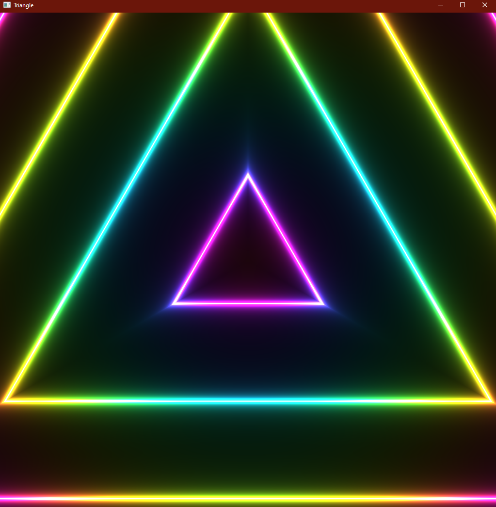

# simple-sdf-compute-shader

This compact application uses _Rust_ and _Vulkano_ to render a triangle pattern on screen. I created a simple compute shader that uses signed distance functions. This is just for my personal learning.

The shader code is actually ported from one of my _Shadertoy_ projects: [link](https://www.shadertoy.com/view/Dt3czn)

